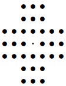

# peg-solitaire

Find one or all solutions to the peg solitaire board game (see [wikipedia](https://en.wikipedia.org/wiki/Peg_solitaire)) in java.
A solution can be printed to console. 

Example print of a position for the english board:


Supported boards:
* english board
* quadratic board (size 4, 5 or 6)

## Usage
* run via *Docker* (this will find one solution using depth first search for the english board and print it to console)
    ```
    docker pull tobiasgaenzler/pegsolitaire:v1.0
    docker run -i tobiasgaenzler/pegsolitaire:v1.0 
    ```
* Alternative: run *mvn clean install* and execute it the created jar via *java -jar target/pegsolitaire-0.0.1-SNAPSHOT.jar*

You can choose board and strategy via command line e.g. --board="Quadratic Board Size Four" --strategy="parallel"
However choosing "parallel" strategy might lead to high memory usage > 10 GB (approx. 450.000.000 Long)

Available options:
* --board: "English Board", "Quadratic Board Size Four", "Quadratic Board Size Five", "Quadratic Board Size Six"
* --strategy: 
  
  "depthFirst" search for one solution on the board starting with the start position provided by the board
  using a depth first search algorithm. The solution is printed to console.

  "parallel" finds all *winning* positions for the board (positions from which the final position can be reached).
  Winning positions are stored in files.

## Algorithm
A java *long* (64 bits) is used to represent positions on a board (bit set means a peg is located at this position).

For finding a single solution a depth first search is performed (solution written to file).

When all winning positions are computed the following steps are executed:
* for each position compute recursively following positions 
  (repeat until there final position is reached or there are no possible moves)
* remove all positions from which the final position can not be reached  
The *winning* positions (positions from which the final position can be reached) are written to file.


## Performance
Performance (speed and memory consumption) significantly improves when symmetric positions are considered as identical 
(e.g. a position is identical when the board is rotated).

To reduce memory consumption several java libraries which support collections of primitives like 
[trove](https://bitbucket.org/trove4j/trove/src/master/) or  [hppc](https://github.com/carrotsearch/hppc)
have been tested. The memory consumption can be reduced (by approximately 30%) with these libraries.
However, using these libraries prevents the usage of the convenient *set.stream().parallel()* and 
concurrency needs to be explicitly programmed.

Memory consumption can be further reduced by persisting sets of positions for a fixed number of pegs to file 
when not needed any longer and read them from file when needed again.

Ideas from:
* http://code.google.com/p/peg-solitaire/source/browse/src/com/googlecode/pegsolitaire
* http://en.wikipedia.org/wiki/Peg_solitaire#Studies_on_peg_solitaire
* http://www.durangobill.com/Peg33.html
* http://www.gibell.net/pegsolitaire/English/index.html
